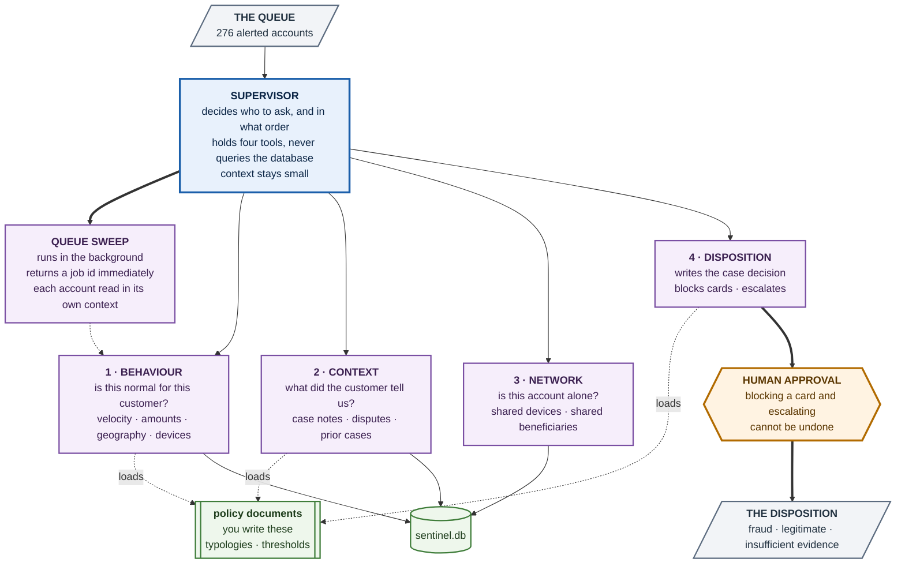
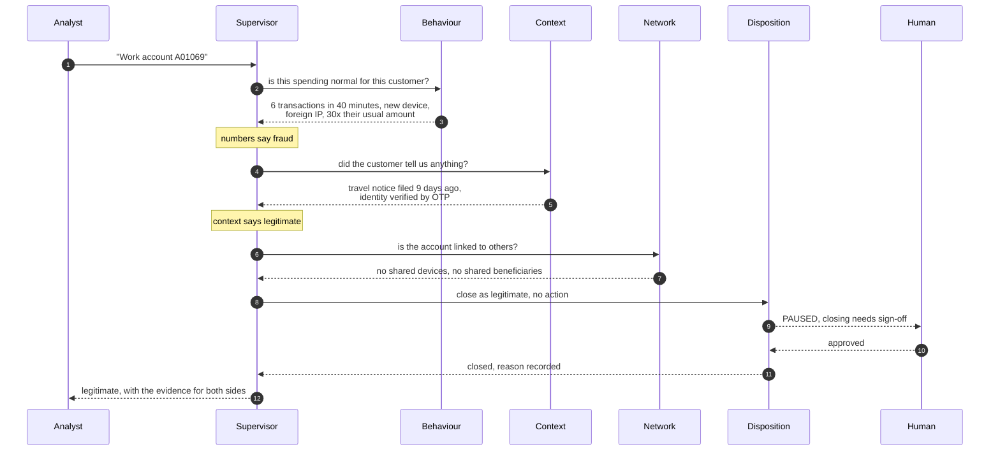

<div align="center">

# Sentinel

### It is Monday morning. 276 accounts were flagged over the weekend.
### Two thirds of them did nothing wrong.

**Build the multi-agent system that works out which is which.**

`Due 31 August`

</div>

---

## Your task in one paragraph

Build a multi-agent system that triages the fraud alert queue in `data/sentinel.db`
and produces a defensible verdict for **every one of the 276 alerted accounts**.

Your system must run in two modes:

| Mode | Called with | Returns |
|---|---|---|
| **Single case** | one account id, e.g. `A00985` | a verdict plus the full reasoning trail |
| **Queue sweep** | nothing | a job id **immediately**, then works all 276 accounts in the background |

The hard part is not writing the SQL. The database will happily tell you that an
account made six transactions in forty minutes from a foreign IP. The hard part
is that a colleague typed a note two weeks ago explaining exactly why, and your
system has to go and read it.

---

## The situation

You have joined the fraud operations desk at Sentinel Bank.

Over the weekend, eight automated rules fired on customer accounts. Velocity
spikes, new devices, transactions from foreign IPs at three in the morning. The
queue is waiting for you.

Most of it is noise. Somebody flew to Dubai and told nobody. Somebody bought
their daughter a laptop. Somebody's wife used the supplementary card.

Buried in it is real money walking out of the bank.

<table>
<tr><td width="33%" align="center">

### 276
accounts flagged

</td><td width="33%" align="center">

### 34%
are actually fraud

</td><td width="33%" align="center">

### 0
of the rules is reliable

</td></tr>
</table>

Every rule in this system fires on both fraud and legitimate customers. The
best rule is right 59% of the time. The worst is right 23% of the time. You
cannot triage this queue by looking at which rule fired.

---

## The five requirements

This is what "the five requirements work" means in the rubric. Four are
required. One is optional and earns credit if you do it well.

### 1 · Specialist subagents &nbsp;`required`

Four agents, each with its own prompt and **only** the tools for its own domain.

| | Reads | Answers |
|---|---|---|
| **Behaviour** | 108,249 transactions | Is this spending normal *for this customer*? |
| **Context** | 260 case notes, 86 disputes, 200 prior cases | Did the customer already explain this? |
| **Network** | devices and merchants across accounts | Is this account acting alone? |
| **Disposition** | writes, does not read | What do we do, and who has to approve it? |

Each one is wrapped as a tool the supervisor calls, and **only the specialist's
final message travels back**.

> If your behaviour analyst spots a velocity spike and leaves it out of its
> final message, the supervisor never learns it. That message is the entire
> interface between the two.

**Done when:** each specialist runs on its own message list, and you can show
that the supervisor never sees a specialist's intermediate tool output.

### 2 · A supervisor that only routes &nbsp;`required`

It holds the four specialist tools and **no database access at all**. It decides
who to ask, in what order, and assembles the verdict from what comes back.

**Done when:** your supervisor has zero SQL tools and still produces verdicts.

### 3 · Asynchronous queue sweep &nbsp;`required`

276 accounts processed one after another is a bottleneck, not a design. Starting
a sweep must return a **job id straight away**, not block until it finishes.

You need three tools: start the sweep, check its status, collect the result.

**Done when:** the call that starts the sweep returns in under a second, and a
later call retrieves the finished work.

### 4 · Policy in documents, loaded on demand &nbsp;`optional, credited`

Fraud typologies, risk appetite and escalation thresholds belong in files an
analyst can edit without touching code. An agent loads the one it needs, when it
needs it, instead of carrying all of them in every prompt.

**These files are not in this repo. You write them.** That is part of the task.

**Done when:** an agent's prompt grows only when it actually loads a policy.

### 5 · Human approval before anything irreversible &nbsp;`required`

Blocking a card and escalating a case both have to pause and wait for a person.
The run must then resume correctly on approval **and** on rejection.

You do **not** need a human to approve all 276. Demonstrate the pause and both
resume paths on a handful of cases, and let the sweep run without it.

**Done when:** you can show a run that pauses, and two transcripts, one approved
and one rejected, that continue correctly.

---

## The architecture



---

## How one case runs



**Order matters.** You cannot dispose of a case before you have read the
context, and you cannot block a card before a human has approved it.

---

## Why this needs more than one agent

Screening the whole queue means pulling every alerted account's transaction
history, case notes, disputes and prior investigations. That is about
**350,000 tokens** of source material.

A single agent holding all the tools does not read that once. It accumulates it,
and every subsequent model call reprocesses everything it has already seen.

<table>
<tr><th></th><th align="right">Tokens processed</th><th align="right">Cost</th></tr>
<tr><td>One agent, all tools</td><td align="right"><b>61,300,000</b></td><td align="right"><b>$122</b></td></tr>
<tr><td>Specialists, isolated contexts</td><td align="right"><b>424,000</b></td><td align="right"><b>$0.85</b></td></tr>
</table>

> **150 times the work for the same answer.**

You do not have to reproduce these exact figures. You do have to measure the
token count your own sweep processed and report it, which is the point of the
write-up.

---

## What makes this hard

**The numbers run out at 78%.** Grid-searching every simple rule over amounts,
velocity, geography, time of day and which alert fired reaches 78% accuracy.
Guessing "legitimate" every time already gets 66%. Reading the case notes takes
it to **92%**. Those 14 points are the assignment.

**The same signature means both things.** A new device plus a high-value
transaction is account takeover. It is also somebody who upgraded their phone.
Six transactions in an hour from a foreign IP is a card spree. It is also a
family holiday. The only difference is in the text.

**Some cases genuinely cannot be resolved.** For 30% of the hard cases the notes
are silent or unhelpful. A system that forces every case into fraud or
legitimate is wrong. `insufficient_evidence` has to be used honestly, and not as
a hiding place.

---

## The data

`data/sentinel.db`, 17.6 MB, entirely local. Full reference in
**[SCHEMA.md](SCHEMA.md)**.

| | |
|---|---|
| 1,200 customers, 1,458 cards, 1,520 devices | four months of history |
| **108,249 transactions** | 2 Nov 2025 to 2 Mar 2026 |
| **411 alerts on 276 accounts** | fired by 8 rules over the weekend |
| 260 case notes, 86 disputes, 200 prior cases | the free text |
| 400 merchants | including crypto, gift cards and money transfer |

There is **no `is_fraud` column**. Do not go looking for one. The verdict is not
in the database, it is in the evidence.

---

## Getting started

Run these three queries before you write a single line of agent code.

```sql
-- 1. What fired, and how often
SELECT r.rule_id, r.name, COUNT(*) AS fired
FROM alerts a JOIN rules r USING(rule_id)
GROUP BY r.rule_id ORDER BY fired DESC;

-- 2. One account's recent behaviour
SELECT ts, amount, channel, ip_country, auth_result
FROM transactions WHERE account_id = 'A00985'
ORDER BY ts DESC LIMIT 20;

-- 3. What a human wrote about that same account
SELECT n.created_at, n.author, n.note
FROM case_notes n
JOIN accounts a ON a.customer_id = n.customer_id
WHERE a.account_id = 'A00985';
```

Query 2 makes `A00985` look like account takeover. Query 3 explains it in one
sentence. **That join is the whole assignment.** If your context specialist
cannot make that hop, it will fail on roughly a third of the queue.

---

## What you hand in

A repository containing:

**1. Your code.**

**2. `README.md`** saying how to run it.

**3. `DISPOSITIONS.md`**, your system's verdict on all 276 accounts, as a table:

| account_id | verdict | confidence | reasoning |
|---|---|---|---|
| `A00985` | `legitimate` | `high` | R02 fired on three high-value purchases from a new device. Case note of 14 Feb records a phone upgrade verified by video KYC. Same IP country throughout, daytime hours. |
| `A00782` | `fraud` | `high` | Same new-device signature, but 03:41 to 04:17 across five IP countries. Customer reported an unrequested device registration SMS and still holds the card. |

Verdict must be one of `fraud`, `legitimate`, `insufficient_evidence`.
Confidence must be one of `high`, `medium`, `low`.

**4. `CASES.md`**, three worked cases in full, showing what each specialist found
and how the supervisor weighed them. Pick one obvious fraud, one convincing
false positive, and one you could not resolve.

**5. `WRITEUP.md`**, one page: the token count your sweep actually processed,
your estimate for a single-agent version, and the case your system got most
wrong.

---

## Scoring

| | |
|---:|---|
| **35%** | The five requirements work |
| **35%** | Did it read, or did it count |
| **20%** | Are the dispositions defensible |
| **10%** | Write-up |

Full rubric with the band descriptors: **[RUBRIC.md](RUBRIC.md)**.

> You are not scored on raw accuracy. A system that scores 80% by ignoring the
> notes is worth less than one that scores 75% and can explain every call.

---

## Practical notes

**Time.** Budget one to two weeks.

**Cost.** A full sweep with properly isolated specialist contexts is roughly
400,000 tokens, which is well under a dollar on a small model. Develop against
ten or twenty accounts, and only run all 276 once the pipeline is stable. If
your sweep is costing tens of dollars, your contexts are not isolated, and the
write-up is where you will have to explain that.

**Models and frameworks.** Anything you like. The patterns are the point, not
the library.

---

## Questions people ask

**Do I really have to run all 276?** Yes, `DISPOSITIONS.md` needs every one. But
develop on a small subset first.

**Where are the policy documents?** You write them. Requirement 4 is about
designing what an editable policy file should contain.

**Is there an answer key in the repo?** No, and there is no `is_fraud` column.
Every label was removed on purpose.

**How accurate do I need to be?** Accuracy is not the score. A defensible wrong
call beats a lucky right one with no evidence behind it.

**Can I just preprocess everything with SQL and skip the agents?** You can, and
you will hit 78% and lose most of the marks. See the rubric.

**What if an account has no case notes at all?** Then `insufficient_evidence`
may well be the honest answer. Some accounts genuinely have none.

**Does the human approval gate have to run 276 times?** No. Demonstrate it works
on a few cases, including one rejection.

---

## Rules

- Everything is local. No internet at run time except your model API.
- Do not modify `data/sentinel.db`.
- Any framework you like.

<div align="center">
<sub>Synthetic data, generated for teaching. No real customers, accounts or transactions.</sub>
</div>
