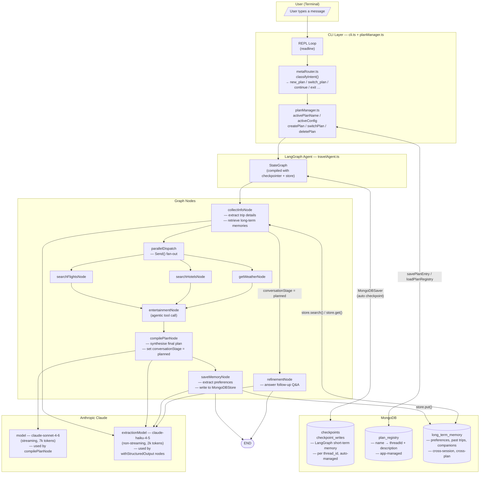
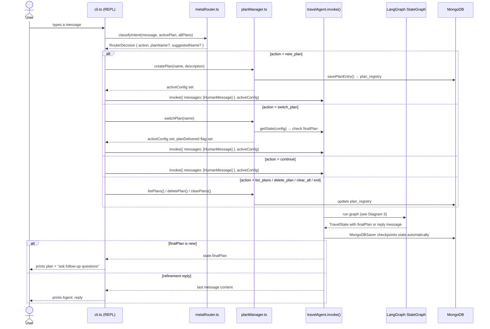
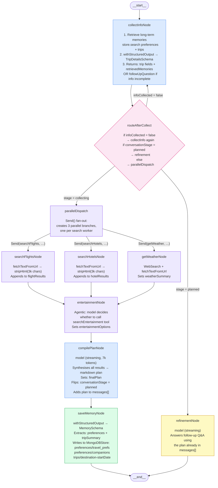
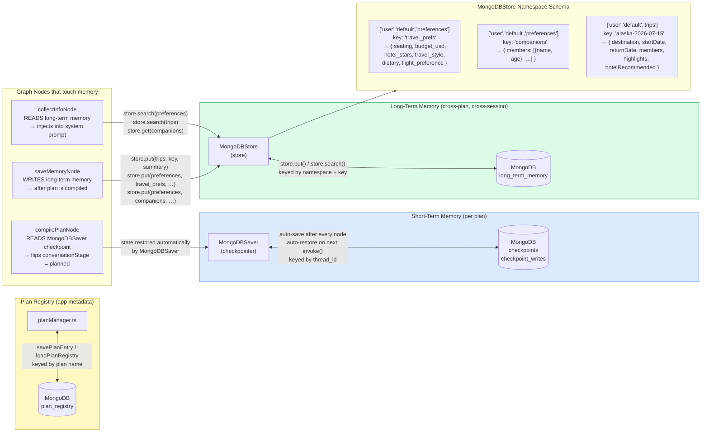
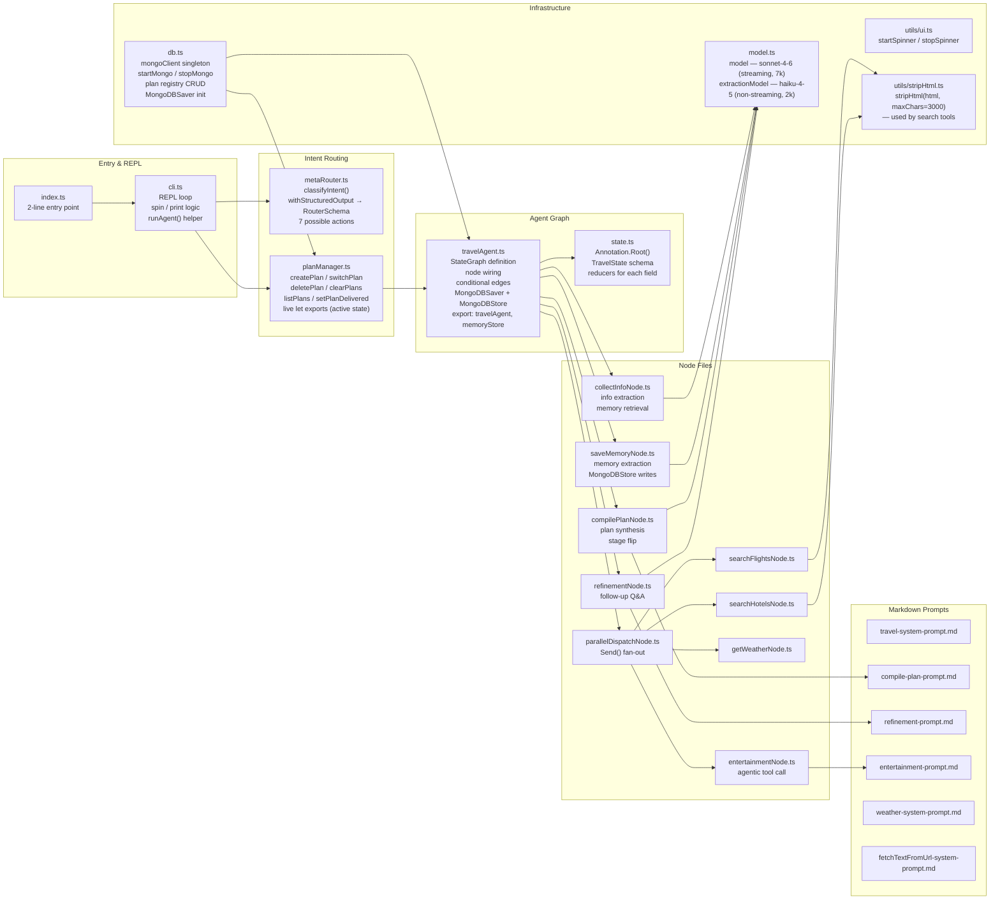

# LearningLangChart — Architecture & Flow

Four diagrams covering: overall system components, per-message request flow, the LangGraph node graph, and the memory architecture.

---

## 1. System Component Overview

High-level: what exists, what owns what, how the layers connect.

---

## 2. Per-Message Request Flow

What happens step by step from the moment the user presses Enter to the moment the agent replies.

---

## 3. LangGraph Node Graph

The internal graph structure: nodes, edges, and conditional routing.

---

## 4. Memory Architecture

Three distinct memory layers and how data flows between them.

---

## 5. Scaffolding: File Responsibility Map

Which file owns which concern.

